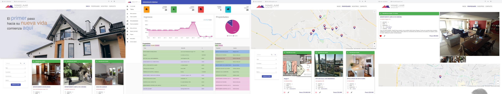
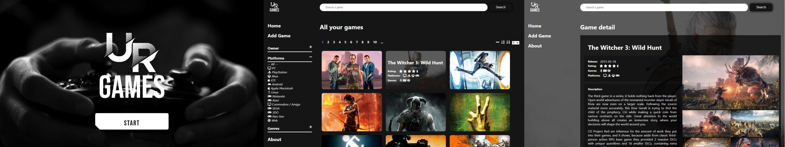
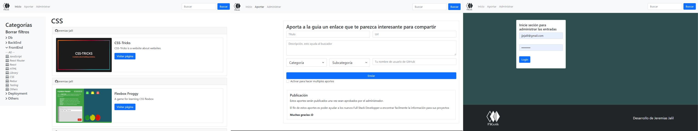
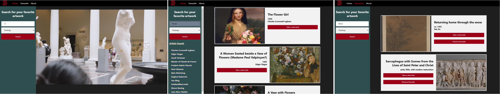

[+%7B%7D;render+%3CGitProfile%2F%3E;npm+start)](https://git.io/typing-svg)

# Lenguajes y tecnologías

 

  
  

 
  

  

# Contacto
### Correo: <a href="mailto:jjejalil@gmail.com">jjejalil@gmail.com </a>
### LinkedIn: <a href="https://www.linkedin.com/in/jeremiasjalil/" target="_blank">in/jeremiasjalil/ </a>

# Proyectos
 
## Makelaar
  
           

Este es un proyecto grupal realizado en conjunto con otros 6 integrantes cuyo objetivo fue el cierre del bootcamp #SoyHenry. Se utilizó la metodología Scrum para el desarrollo donde mi participación se enfocó en la coordinación del equipo, unificación y conexión entre componentes y funcionalidades, implementación de Cloudinary para la gestión de imágenes y documentos, la elaboración del panel del administrador, entre otras actividades.

A modo de resumen, el proyecto fue enfocado en ofrecer una solución integral a las inmobiliarias donde en una sola plataforma pueda gestionar todas sus propiedades, sus clientes, sus contratos y la gestión del pago de los alquileres. Es por ello que se incluyó GoogleMaps para geolocalizar tanto las propiedades como los visitantes, y se implementó MercadoPago como medio para facilitar a los clientes sus pagos. 

### Lo invitamos a ver nuestro video de presentación

<a href="https://makelaar.vercel.app/" target="_blank">🌐 Ver proyecto</a> | <a href="https://github.com/Simon834/Makelaar" target="_blank"> 📂 Ver repo</a>

## URGames
  
     

Este es el proyecto individual requerido para la aprobación del Henry Bootcamp Full Stack Developer, donde pude poner en práctica todo el conocimiento, y vincular una base de datos, con un BackEnd y un FontEnd para lograr un producto funcional

<a href="https://jeremias-jalil.github.io/ur-games/" target="_blank">🌐 Ver proyecto</a> | <a href="https://github.com/jeremias-jalil/ur-games" target="_blank"> 📂 Ver repo</a>

## FSGuide
  
         

El proyecto FSGuide (Full Stack Guide) surge como parte de mi experiencia como Teaching Assistant dentro del Henry Bootcamp donde acompañamos a los alumnos iniciantes en todo el proceso del bootcamp, donde encontré la necesidad de contar con una plataforma con información de referencia para poder facilitar el ingreso de los alumnos al mundo del Full Stack developer

<a href="http://fsguide.click/" target="_blank">🌐 Ver proyecto</a> | <a href="https://github.com/jeremias-jalil/fs-guide" target="_blank"> 📂 Ver repo</a>

## Art-App
 

Mi primer proyecto iniciado desde cero en React-Redux, si bien no está perfecto fue mi primer aplicación funcional y la quiero conservar de recuerdo ☺️ porque  marca el incio de una gran pasión.

<a href="https://jeremias-jalil.github.io/react-art-proyect/" target="_blank">🌐 Ver proyecto</a> | <a href="https://github.com/jeremias-jalil/react-art-proyect" target="_blank"> 📂 Ver repo</a>

 

<!--
**jeremias-jalil/jeremias-jalil** is a ✨ _special_ ✨ repository because its `README.md` (this file) appears on your GitHub profile.

Here are some ideas to get you started:

- 🔭 I’m currently working on ...
- 🌱 I’m currently learning ...
- 👯 I’m looking to collaborate on ...
- 🤔 I’m looking for help with ...
- 💬 Ask me about ...
- 📫 How to reach me: ...
- 😄 Pronouns: ...
- ⚡ Fun fact: ...
-->

